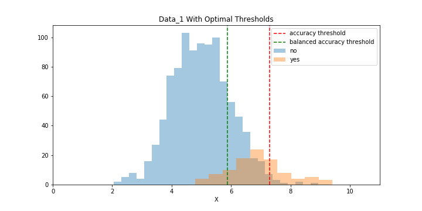
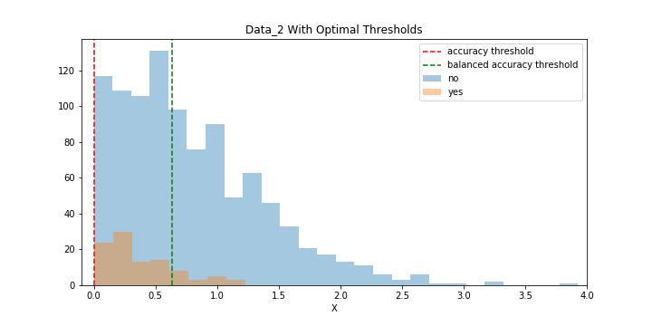

# Handling Imbalanced Data with Basic Classifier Models

## Introduction
In this project, I examined how a Logistic Regression and a Decision Tree Classifier model can be optimised if the underlying data is imbalanced. The Python code uses `scikit-learn`'s classifier models (`LogisticRegression` and `DecisionTreeClassifier` and `undersample` method. I am also using `imblearn` for the more sophisticated `smote` oversampling method. 
 

For more information of the project, please refer to my [blogpost on Medium](https://medium.com/datadriveninvestor/handling-imbalanced-data-with-basic-classifier-models-5ce3d61874f1).
 

The term _“imbalanced data”_ is usually applied to cases where the different values of the target variable are not equally represented in the data. Technically speaking most data is imbalanced to some degree and that’s fine, but a significant difference in target variable groups can make classifier models unreliable. 
 
I am concentrating on two different problems when it comes to training models with imbalanced data: 
- we want to maximize the classifier's accuracy;
- we want to maximize the classifier's balanced accuracy. 
 
These require different mthods, depending on the data structure, and the classifier model we are training. 

## Data
For my project, I am using two sets of simulated data. For both of them, I calculated the optimal threshold depending on whther we want to categorise the observations to maximise accuracy or balanced accuracy. 
 

In `Data_1`, the blue target observations are the minority ones, and they are concentrated to the right of the whole distribution. If we want to achieve the highest accuracy, we should split the data at around 7.3, and if we want to maximize the balanced accuracy, we would split at around 5.9. 

 
In `Data_2`, the blue minority observations are in the middle of the large group. If we want to achieve the highest accuracy, we can't do any better than to classify everything as `no`. This is an important result - we can't always improve the classifier if the data is imbalanced. Highest balanced accuracy can be achieved by splitting at around 0.7. 

## Methods
As mentioned above, I am concentrating on the following two classifier models: 
- Logistic Regression;
- Decision Tree Classifier.
 
I am experimenting with different methods when it comes to offsetting data imbalance, the methods are: 
- random undersampling;
- utilizing scikit-learn's `class_weight` parameter;
- `smote` oversampling.

## Results
My results are summarized in the table below for `Data_1`:

|Model               |Threshold        | Accuracy       | Bal.Acc. |
|--------------------|-----------------|----------------|----------|
|optimal_acc         |   7.3007        |   0.9345       |   0.6715 |
|optimal_bacc        |   5.8716        |   0.8200       |   0.8425 |
|logreg_acc          |   7.1566        |   0.9291       |   0.6730 |
|logreg_bal_acc      |   5.9429        |   0.8345       |   0.8370 |
|logreg_undersampl   |   5.9653        |   0.8409       |   0.8405 |
|logreg_smote        |   5.9523        |   0.8355       |   0.8375 |
|dtree_acc           |   7.3090        |   0.9345       |   0.6715 |
|dtree_bal_acc       |   5.8740        |   0.8200       |   0.8425 |
|dtree_undersampl    |   5.8090        |   0.8045       |   0.8385 |
|dtree_smote         |     n/a         |   0.8264       |   0.8505 |

 

And for `Data_2`:

|Model               |Threshold        | Bal.Acc.|
|--------------------|-----------------|---------|
|optimal_bacc        |   0.6364        |   0.6805|
|logreg_bal_acc      |   0.5460        |   0.6615|
|logreg_undersampl   |   0.5560        |   0.6675|
|logreg_smote        |   0.5482        |   0.6655|
|dtree_bal_acc       |      n/a        |   0.7035|
|dtree_undersampl    |      n/a        |   0.6925|
|dtree_smote         |      n/a        |   0.7095|

For additional details, please refer to my blogpost, link in the Introduction section. 

## Files
The repo contains the following files: 
- `imbalanced_classifier.ipynb`: A Jupyter notebook containing the majority of the work and visualisations. 
- `imbalanced_classifier_functions.py`: Contains functions and useful methods written for this project. 
- `charts` folder: exported charts from the Jupyter notebook. 
